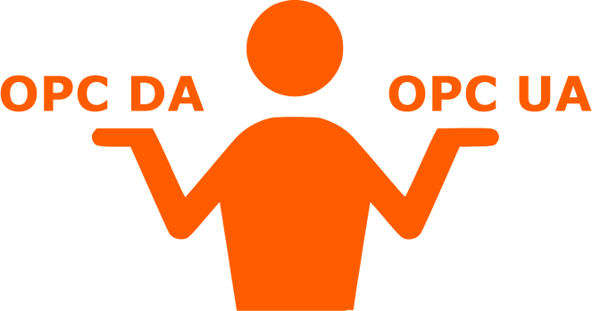
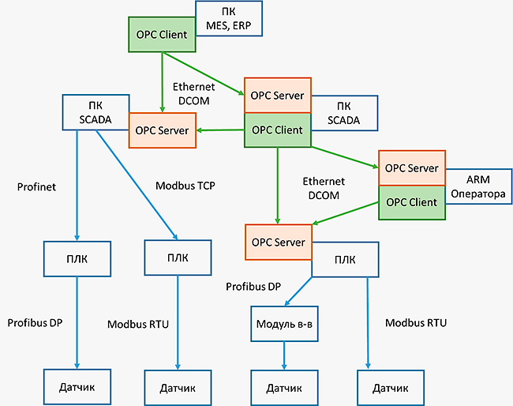
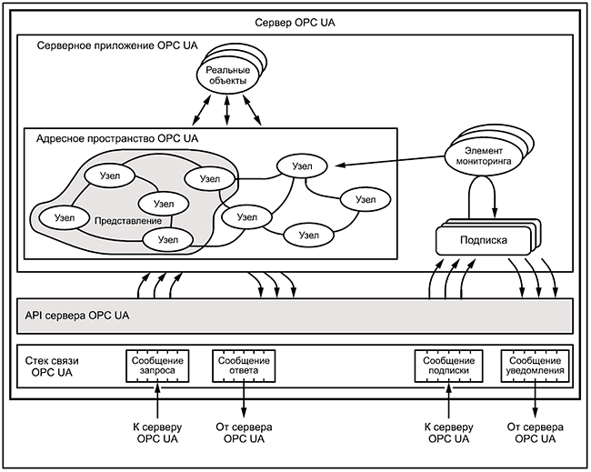
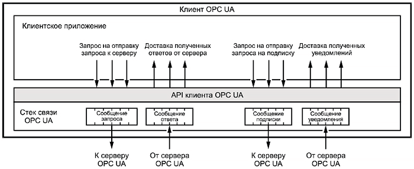
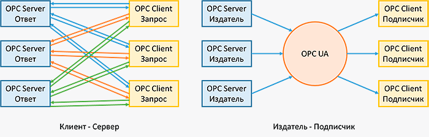
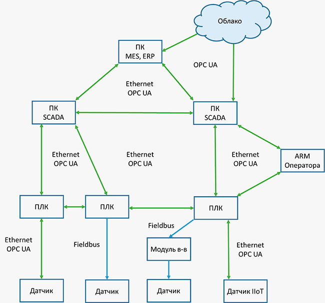

# [Просто о стандартах `OPC DA` и `OPC UA`](https://ipc2u.ru/articles/prostye-resheniya/prosto-o-standartakh-opc-da-i-opc-ua/)

`OPC` (аббр. от англ. `Open Platform Communications`, ранее англ. `OLE for Process Control`) – это набор программных технологий, которые предоставляют единый интерфейс для управления различными устройствами и обмена данными. Спецификации `OPC` были разработаны международной некоммерческой организацией OPC Foundation, которую создали в 1994 году ведущие производители средств промышленной автоматизации. Целью создания OPC было предоставить инженерам универсальный интерфейс для управления различными устройствами.

Реализовав поддержку OPC-клиента, разработчики SCADA-систем избавились от необходимости поддерживать сотни драйверов для различных устройств, а производители оборудования, добавив OPC-сервер, обрели уверенность в том, что их продукт может применяться пользователями любых SCADA-систем.

Технология OPC включает несколько стандартов, которые описывают набор функций определенного назначения. Текущие стандарты:

- **`OPC DA` (Data Access)** — наиболее распространённый стандарт. Описывает набор функций обмена данными в реальном времени с ПЛК, РСУ, ЧМИ, ЧПУ и другими устройствами.
- **`OPC HDA` (Historical Data Access)** предоставляет доступ к уже сохраненным данным и истории.
- **`OPC AE` (Alarms & Events)** — предоставляет функции уведомления по требованию о различных событиях: аварийные ситуации, действия оператора, информационные сообщения и другие.
- **`OPC Batch`** — предоставляет функции шагового и рецептурного управления технологическим процессом.
- **`OPC D`X (Data eXchange)** — предоставляет функции организации обмена данными между OPC-серверами через сеть Ethernet. Основное назначение — создание шлюзов для обмена данными между устройствами и программами разных производителей.
- **`OPC Security`** — определяет функции организации прав доступа клиентов к данным OPC-сервера.
- **`OPC XML-DA` (XML-Data Access)** — предоставляет гибкий, управляемый правилами формат обмена данными через `XML`, `SOAP` и `HTTP`.
- **`OPC Complex Data`** — дополнительные спецификации к `OPC DA` и `XML-DA`, которые позволяют серверам работать со сложными типами данных, такими как бинарные структуры и XML-документы.
- **`OPC Commands`** — набор программных интерфейсов, который позволяет ОРС клиентам и серверам идентифицировать, посылать и контролировать команды, исполняемые в контроллере или модуле ввода-вывода.
- **`OPC UA` (Unified Architecture)** — последняя по времени выпуска спецификация, которая основана не на технологии Microsoft COM, что предоставляет кроссплатформенную совместимость.

Самое широкое распространение получил стандарт `OPC DA`, но у него есть существенный недостаток. Во времена его разработки он был построен на современных Windows-технологиях: OLE, ActiveX, COM/DCOM, но с тех пор в отрасли прошли изменения и большое распространение получили другие ОС и технологии. Поэтому технологию OPC сделали платформонезависимой и разработали стандарт `OPC UA` (Unified Architecture) на открытых кроссплатформенных технологиях.

## Применение `OPC`

Обычно технологию `OPC` применяют для обмена данными между контроллерами и SCADA-системой, но также возможна организация сложных систем на разных уровнях АСУ ТП.

OPC состоит из двух частей: OPC-клиента и OPC-сервера. ПО OPC-сервера через драйверы устройств по полевым шинам опрашивает различные устройства. ПО OPC-клиента обычно встроено в SCADA-систему и предназначено для получения данных с OPC-сервера.

На предприятии можно выделить несколько уровней АСУ:

- нижний уровень — полевые шины (`fieldbus`) и отдельные контроллеры;
- средний уровень — цеховые сети;
- уровень АСУ ТП — уровень работы систем типа SCADA;
- уровень АСУП — уровень приложений управления ресурсами предприятия, ERP, MES.

Каждый из этих уровней может обслуживаться OPC-сервером, поставляя данные OPC-клиенту на более высоком уровне или соседнему устройству.

## Работа `OPC DA` сервера

`OPC DA` сервер обеспечивает обмен данными (запись и чтение) между клиентской программой (обычно SCADA-системой) и конечными устройствами. Данные в `OPC` представляют собой переменную `Тег` с некоторыми свойствами. Переменная может быть любого типа, допустимого в `OLE`: различные целые и вещественные типы, логический тип, строковый, дата, массивом и т. д. Свойства могут быть обязательными, рекомендуемыми и пользовательскими.

Обязательные свойства:

- **Текущее значение переменной**, ее тип и права доступа (чтение и/или запись).
- **Качество переменной** зависит от выхода измеряемой величины за границы динамического диапазона, отсутствии данных, ошибки связи и других параметров. Обычно принимает значения: хорошее/плохое/неопределенное и дополнительная информация.
- **Метка времени** сообщает о времени, когда переменная получила данное значение.
- **Частота опроса переменной OPC-сервером** задает время обновления значения переменной.
- **Описание переменной**, которое содержит информацию для пользователя о том, что представляет собой эта переменная.

Дополнительно могут быть указаны необязательные свойства: диапазон изменения значения, единица измерения и другие пользовательские параметры.

Для чтения данных из ОРС-сервера можно использовать различные режимы:

- **Синхронный режим**: клиент посылает запрос серверу и ждет от него ответ.
- **Асинхронный режим**: клиент отправляет запрос и сразу же переходит к выполнению других задач. Сервер после обработки запроса посылает клиенту уведомление и тот забирает предоставленные данные.
- **Режим подписки**: сервер отсылает клиенту только те теги, которые изменились. Для того, чтобы шум данных не был принят за их изменение, вводится понятие "мертвой зоны", которая слегка превышает максимально возможный размах помехи.
- **Режим обновления данных**: клиент вызывает одновременное чтение всех активных тегов. Активными называются все теги, кроме обозначенных как "пассивные". Такое деление тегов уменьшает загрузку процессора обновлением данных, принимаемых из физического устройства.

Клиент получает данные от ОРС-сервера либо из буфера, либо сразу из конечного устройства. Чтение из буфера выполняется быстрее, но данные в нем могут устареть к моменту чтения. ОРС-сервер периодически обновляет данные, запрашивая информацию у конечных устройств.

Запись данных в конечное устройство осуществляется в синхронном или асинхронном режимах без промежуточной буферизации. В синхронном режиме клиент осуществляет запись данных и ждет пока не получит подтверждение о выполнении команды от конечного устройства. Этот процесс может занимать много времени, в течении которого клиент находится в ожидании. Асинхронный режим позволяет клиенту отправить запрос серверу и заниматься другими задачами. После окончания записи сервер отправит клиенту уведомление.

## Примеры `OPC DA` сервера

Для примера возьмём SCADA-систему [Trace Mode 6](https://ipc2u.ru/catalog/programmnoe-obespechenie/scada-trace-mode-6/), в которой реализована функция `OPC DA` сервера. Trace Mode 6 можно поставить на ПК, либо сразу на [контроллер](https://ipc2u.ru/catalog/promyshlennaya-avtomatizaciya/promyshlennye-kontrollery/trace-mode/).

SCADA *Trace Mode 6* может опрашивать различные модули ввода-вывода и управлять контроллерами по стандартным промышленным протоколам типа: `Modbus`, `МЭК 60870-5-104`, `HART` и другим. Но промышленные протоколы не предназначены для обмена данными между SCADA и ERP, MES системами. Тут придет на помощь стандарт `OPC DA`, который позволит собрать различные данные с исполнительных модулей SCADA. `OPC DA` сервер для получения данных с Trace Mode доступен как [отдельный модуль](https://ipc2u.ru/catalog/programmnoe-obespechenie/scada-trace-mode-6/opc_servers/), так и в составе модулей [OPC МРВ+](https://ipc2u.ru/catalog/programmnoe-obespechenie/scada-trace-mode-6/opc_rtm_plus_windows/) или [OPC ДокМРВ+](https://ipc2u.ru/catalog/programmnoe-obespechenie/scada-trace-mode-6/opc_doc_rtm_plus_windows/).

Также *Trace Mode 6* может выступать в качестве OPC-клиента и получать данные с `OPC DA` серверов различных производителей. Например, есть [видео урок](http://www.adastra.ru/products/drivers/opc_connect/) подключения *Trace Mode 6* к *NAPOPC DA Server* – это `OPC DA` сервер от компании *ICP DAS*.

[NAPOPC DA Server](http://opc.icpdas.com/opcda.htm) – это бесплатный `OPC DA` сервер для опроса модулей ввода-вывода *ICP DAS*. Его можно установить на ПК, либо прямо контроллеры *ICP DAS* с ОС:

- Windows 10 — [XP-9781-IoT](https://ipc2u.ru/catalog/xp-9781-iot)
- Windows WES — [XP-9781-WES7](https://ipc2u.ru/catalog/xp-9781-wes7)
- Windows CE 6.0 — [XP-8731-CE6](https://ipc2u.ru/catalog/xp-8731-ce6)
- Windows CE 5.0 — [WP-8841-EN](https://ipc2u.ru/catalog/wp-8841-en)

NAPOPC DA Server позволяет опрашивать модули: [I-7000](https://ipc2u.ru/catalog/promyshlennaya-avtomatizaciya/sredstva-udalennogo-vvoda-vyvoda/rs-485-moduli/?productsFilter&set_filter=Y&630149%5B%5D=ICP+DAS&622667%5B%5D=Slave&618729%5BLEFT%5D=&618729%5BRIGHT%5D=&618731%5BLEFT%5D=&618731%5BRIGHT%5D=&618484%5BLEFT%5D=&618484%5BRIGHT%5D=&618457%5BLEFT%5D=&618457%5BRIGHT%5D=&618533%5BLEFT%5D=&618533%5BRIGHT%5D=), [M-7000](https://ipc2u.ru/catalog/promyshlennaya-avtomatizaciya/sredstva-udalennogo-vvoda-vyvoda/rs-485-moduli/?productsFilter&set_filter=Y&630149=&622667=&630149%5B%5D=ICP+DAS&618609%5B%5D=Slave&618729%5BLEFT%5D=&618729%5BRIGHT%5D=&618731%5BLEFT%5D=&618731%5BRIGHT%5D=&618484%5BLEFT%5D=&618484%5BRIGHT%5D=&618457%5BLEFT%5D=&618457%5BRIGHT%5D=&618533%5BLEFT%5D=&618533%5BRIGHT%5D=), [ET-7000](https://ipc2u.ru/catalog/promyshlennaya-avtomatizaciya/sredstva-udalennogo-vvoda-vyvoda/ethernet-moduli/?productsFilter&set_filter=Y&630149%5B%5D=ICP+DAS&618608%5B%5D=Slave&618729%5BLEFT%5D=&618729%5BRIGHT%5D=&618731%5BLEFT%5D=&618731%5BRIGHT%5D=&618484%5BLEFT%5D=&618484%5BRIGHT%5D=&618457%5BLEFT%5D=&618457%5BRIGHT%5D=&618533%5BLEFT%5D=&618533%5BRIGHT%5D=), [I-8K](https://ipc2u.ru/catalog/promyshlennaya-avtomatizaciya/moduli-rasshireniya-dlya-kontrollerov/moduli-i-8k-parallelnaya-shina/), [I-87K](https://ipc2u.ru/catalog/promyshlennaya-avtomatizaciya/moduli-rasshireniya-dlya-kontrollerov/moduli-i-87k-posledovatelnaya-shina/) и корзины [RU-87Pn](https://ipc2u.ru/catalog/promyshlennaya-avtomatizaciya/korziny-vvoda-vyvoda/rs-485-modulnye-korziny/?productsFilter&set_filter=Y&630149%5B%5D=ICP+DAS&618533%5BLEFT%5D=&618533%5BRIGHT%5D=).

## Стандарт `OPC UA`

`OPC UA` (Unified Architecture) – это современный стандарт, описывающий передачу данных в промышленных сетях. Он обеспечивает защищенную и надежную коммуникацию между устройствами, являясь при этом аппаратно- и платформо-независимым, что позволяет обеспечить обмен данными между устройствами с разными операционными системами.

Сильными сторонами `OPC UA` является объектно-ориентированная информационная модель, которая позволяет «просматривать» данные (в стиле web-браузера), и сервис ориентированная архитектура (`SOA`). Если раньше приходилось использовать несколько OPC-серверов: `OPC DA` для данных в реальном времени, `OPC HDA` для истории и `OPC AE` для событий, то теперь все это и многое другое доступно в одном стандарте `OPC UA`. Вместо дерева тегов, теперь вводится понятие узлов или объектов. Каждый узел включает в себя переменные, методы и другие структуры данных реального объекта.

Обмен данными теперь происходит через бинарные структуры и XML-документы. В дополнение к модели клиент/сервер становится доступна модель издатель/подписчик. Также стандарт определяет механизм для поддержки резервирования (если один клиент станет не доступным, то его заменит другой) и быстрого восстановления связи в случае сбоя. Передача данных происходит через транспортный слой TCP, HTTP/SOAP или HTTPS. Вместо механизмов контроля прав доступа Windows, в `OPC UA` реализована поддержка цифровых сертификатов и возможность шифрования передаваемых данных.

Реализована обратная совместимость с `OPC DA` через специальную оболочку (wrapper) и proxy-модуль. Для передачи данных через маршрутизаторы и межсетевые экраны `OPC DA` требовал использовать промежуточное ПО, `OPC UA` же работает без прослойки. Спецификация `OPC UA` включает в себя несколько частей, которые описывают логику работы серверов и клиентов. Детальная версия спецификации доступна в стандарте `IEC 62541`.

## Пример `OPC UA` сервера

Примером `OPC UA` сервера может стать набор ПО *MX-AOPC UA Suite* от компании MOXA. В [MX-AOPC UA Suite](https://moxa.pro/news/new/mx-aopc-ua-suite-pozvolit-podklyuchit-modbus-ustroystva-k-scada-po-opc-ua/) входит 3 программы:

- `Server` – для получения данных с Modbus-устройств
- `Viewer` – для просмотра тегов и состояния сервера (`Viewer` встроен в `Server`)
- `Logger` – для ведения истории изменения данных, а также интеграции с базами данных и облачными решениями

В первую очередь *MX-AOPC UA Server* ориентирован на модули ввода-вывода MOXA, т.к. там реализована функция `Active Tag`, но также поддерживается подключение сторонних устройств по протоколам `Modbus RTU` и `Modbus TCP`. Функция `Active Tag` позволяет обновлять состояние каналов сразу после их изменения, не дожидаясь команды со стороны сервера.

MX-AOPC UA Logger позволяет отправлять данные в облако *Microsoft Azure* и базы данных *Microsoft SQL Server*, *MySQL*, *Oracle*, *Microsoft Office 2003 Access* или *Excel* через `ODBC`.

В *MX-AOPC UA* реализована защита данных через шифрование ключом Basic128Rsa15 и подтверждение сертификатом X509.

## Минусы применения OPC

Конечно у любой хорошей технологии есть свои минусы. Например, разработчики SCADA Trace Mode 6 из компании АдАстра Рисерч Груп, [выделяют типовые ошибки в проектировании АСУ ТП](http://www.adastra.ru/support/news/oshibki_proektirovaniya_asutp/).

К ошибкам можно отнести:

- Злоупотребление OPC-технологиями
- Неоправданное применение WEB-технологий в АСУ ТП
- Применение протоколов реального времени в телемеханических задачах

Например, вы узнали о хорошей технологии OPC и стремитесь заменить все протоколы нижнего уровня только на OPC. Но конвертация промышленных протоколов `Modbus`, `Profibus` и любых других на ПК будет занимать дополнительное время и тратить ресурсы компьютера. Тесты показали, что SCADA-система работает в 2 раза быстрее напрямую с промышленными протоколами, чем через промежуточный OPC-сервер. Конечно, есть системы где процесс не нужно контролировать в реальном времени, но это нужно учитывать при проектировании АСУ ТП.

К недостаткам также можно отнести сложность настройки OPC-сервера и необходимость ручной привязки тысячи тегов. Кроме того, OPC-сервер не всегда поставляется бесплатно и чаще всего на каждый ПК придется покупать отдельную лицензию.

Если система отправляет данные через Интернет в Облако, то наличие слабого шифрования может стать потенциальной уязвимостью и целью для атак хакеров, что ставит под сомнение безопасность всей АСУ ТП.

## `OPC UA` для работы в реальном времени

**`OPC UA` over `TSN`** — для поддержки работы в реальном времени технология `OPC UA` (вместо модели клиент/сервер) может использовать модель издатель/подписчик совместно с технологией `TSN` (Time-Sensitive Networking).

Модель клиент/сервер хорошо работает в случае подключения точка-точка, но если устройств становится много, то появляются задержки в обновлении данных. Модель издатель/подписчик обеспечивает связь от одного ко многим и от многих ко многим. Сервер отправляет свои данные в сеть (публикация) и каждый клиент может получить эти данные (подписка).

Технология Ethernet с `TSN` дополняет существующие средства Ethernet в том, что касается обеспечения качества обслуживания трафика (QoS), включая выделение полосы пропускания, синхронизацию, гарантию низких значений задержки и обеспечения резервирования. Данные, которые передают различные устройства по Ethernet сети, представляют собой потоки. Ethernet коммутаторы с `TSN` позволяют выделить для каждого потока свою полосу пропускания и обеспечить его передачу в реальном времени. Несколько потоков можно объединить (это называется сетевой конвергенцией) и организовать их передачу по одной сети в режиме реального времени. Получается без технологии `TSN` по одной Ethernet сети можно передавать только один протокол реального времени, а с `TSN` несколько.

Объединение технологий `OPC UA` over `TSN` позволяет организовать коммуникацию между оборудованием от разных производителей и гарантировать непрерывное получение данных в режиме реального времени.

OPC Foundation планирует использовать `OPC UA` не только для передачи данных между контроллерами и SCADA-системой, но и на полевом уровне от датчиков и IoT устройств к контроллерам, а также от локальных систем в Облако. Для этого планируют разбить стандарт `OPC UA` на 4 части в зависимости от производительности устройства и необходимых ему возможностей.

- **Nano Embedded Device Server**: подходит для самых маленьких датчиков;
- **Micro Embedded Device Server**: подходит для недорогих ПЛК;
- **Embedded UA Server**: подходит для более мощных ПЛК и пограничных шлюзов;
- **Standard UA Server**: полноценная реализация, поддерживающая все функции.

## Перспективы

Можно с уверенностью сказать, что, хотя стандарт `OPC DA` все еще широко применяется, но уже не удовлетворяет современным требованиям автоматизации. Он основан на устаревших технологиях, сложен в настройке и не соответствует современным стандартам безопасности. На смену ему пришел современный стандарт `OPC UA` с возможностью шифрования данных и построения единых систем передачи данных от датчиков до Облака. Совместное использование `OPC UA` с `TSN` позволяет значительно расширить возможности технологии для передачи данных в реальном времени. Конечно не стоит сейчас же бежать и избавляться от `OPC DA`, но можно постепенно модернизировать существующие системы и переходить на `OPC UA` через специальные оболочки (wrapper) и proxy-модули.
